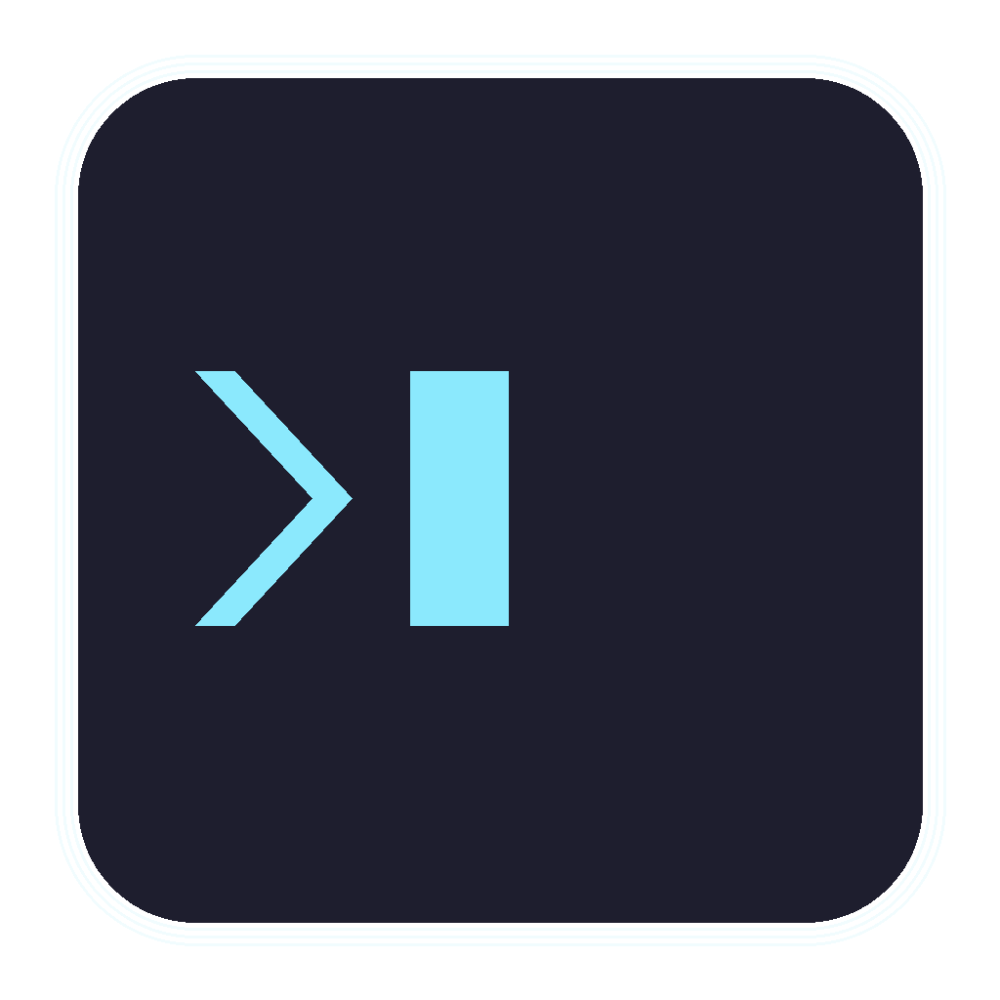

# VibedTerm

<p align="center">
  
</p>

A modern, Flutter-based SSH terminal client for Windows, Linux, and Android. Features an encrypted vault for secure credential storage, multi-tab terminal sessions, tmux integration, cloud sync, SFTP file browser, port forwarding, and customizable themes.

## Zero-Knowledge Architecture

VibedTerm is designed with a **zero-knowledge security model**:

```
┌─────────────────────────────────────────────────────────────┐
│                      YOUR DEVICE                             │
│                                                              │
│   Password ──▶ Argon2id KDF ──▶ Encryption Key              │
│                     │                                        │
│   Plaintext ◀─────▶ XChaCha20-Poly1305 ◀─────▶ Vault File   │
│                                                              │
└─────────────────────────────────────────────────────────────┘
                              │
                              ▼
               VibedTerm Sync Server
               (only encrypted blobs, zero-knowledge)
```

**Key principles:**

- **Zero-knowledge server** - The sync server only stores encrypted blobs; it cannot read your data
- **Password never transmitted** - Used only locally to derive the encryption key via Argon2id
- **End-to-end encryption** - All vault data encrypted with XChaCha20-Poly1305 before sync
- **Multi-device sync** - Sync your vault across desktop and mobile devices
- **Two-factor authentication** - Optional TOTP 2FA for server account security
- **Open source** - Verify the security model yourself

See [Security Architecture](docs/security_architecture.md) for detailed cryptographic design.

## Features

### Cloud Sync
- **Zero-Knowledge Server**: Self-hosted Go server for encrypted vault synchronization
- **Multi-Device Sync**: Sync hosts, identities, and snippets across all your devices
- **Auto-Sync**: Automatic debounced sync after every vault change
- **TOTP 2FA**: Optional two-factor authentication for server account
- **User Web UI**: Manage account settings, password, 2FA, and devices via browser
- **Admin Web UI**: User management dashboard with approval workflow

### Security
- **Encrypted Vault**: Store SSH hosts and identities with Argon2id KDF and XChaCha20-Poly1305/AES-256-GCM encryption
- **Host Key Verification**: Trust prompts with fingerprint display, persisted in vault
- **Auto-Unlock**: Optionally remember vault password securely for auto-unlock on startup
- **Password & Key Auth**: Supports both password and private key authentication
- **SSH Key Import**: Import private keys directly from `~/.ssh/` with fingerprint display

### Terminal
- **Multi-Tab Sessions**: Terminus-like UX with independent SSH connections per tab
- **Terminal Search**: Ctrl+F search with regex, case-sensitive, and whole word options
- **Keyboard Shortcuts**: Ctrl+Tab to cycle tabs, Ctrl+1-9 for direct access, Ctrl+T/W to open/close
- **12 Color Themes**: Dark and light themes including Dracula, Monokai, Solarized, Nord, Gruvbox, One Dark/Light, GitHub Light
- **App-Wide Theming**: Terminal theme colors apply to the entire application
- **Customizable**: Font size, font family, cursor style, background opacity
- **Command Snippets**: Save and quickly send frequently used commands to terminal sessions
- **Mobile Extra Keys**: Scrollable row with arrows, Ctrl combos, and special characters on Android/iOS

### SSH Features
- **Port Forwarding**: Local and remote SSH tunnel management via UI
- **SFTP File Browser**: Browse directories, upload/download files, drag & drop support
- **Auto-Reconnect**: Automatic reconnection with exponential backoff
- **Keepalive**: Configurable interval to prevent disconnection
- **Connection Timeout**: Adjustable timeout for slow connections

### Host Management
- **Host Groups**: Organize hosts in collapsible folders
- **Tailscale Discovery**: Scan and import Tailscale peers as SSH hosts
- **Quick-Connect Bar**: Type `user@host:port` directly in the tab bar

### tmux Integration
- **Auto-Attach**: Automatically attach to or create tmux sessions on connect
- **Session Picker**: Choose from existing sessions when multiple are available
- **Session Manager**: Create, attach, detach, and kill tmux sessions via UI
- **Tab Labels**: Show attached tmux session name in tab header

### UI/UX
- **Compact Sidebar**: Vertical navigation with rotated branding
- **Quick Connect**: Fast host selection via picker or ActionChip shortcuts
- **Status Bar**: Connection info, special keys, paste, snippets, tmux manager
- **Per-Tab Logs**: Collapsible drawer showing connection logs

## Screenshots

*Coming soon*

## Installation

### From Source

```bash
# Clone the repository
git clone https://github.com/sprobst76/vibedterm.git
cd vibedterm

# Get dependencies
flutter pub get

# Run on your platform
cd apps/ssh_client_app
flutter run -d linux    # or windows, or android device
```

### Sync Server (optional)

```bash
cd server

# Configure environment
cp .env.example .env  # Edit with your PostgreSQL credentials

# Build and run
go build -o vibedterm-server ./cmd/server
./vibedterm-server
```

The server provides:
- **User registration** at `/register` (requires admin approval)
- **User settings** at `/account/settings` (password, 2FA, devices)
- **Admin dashboard** at `/admin/` (user management, statistics)

### Requirements

- Flutter 3.16.0 or later
- Dart 3.3.0 or later
- Go 1.23 or later (for sync server)
- PostgreSQL 15+ (for sync server)

## Usage

### Quick Start

1. **Create a Vault**: On first launch, create a new encrypted vault with a master password
2. **Add a Host**: Go to Hosts tab, click "Add host" and enter connection details
3. **Add Identity** (optional): Add your SSH private key for key-based authentication
4. **Connect**: Click the play button on a host or use the Terminal tab

### Settings

Click the gear icon in the sidebar to access:

- **Appearance**: Color theme, font size/family, cursor style, opacity
- **SSH**: Keepalive interval, connection timeout, default port

### tmux Integration

1. **Auto-Attach**: Enable "Auto-attach tmux" when editing a host
2. **Session Name**: Optionally specify a session name, or leave empty for auto-selection
3. **Session Manager**: Click the grid icon in the terminal status bar to manage sessions

## Project Structure

```
vibedterm/
├── apps/
│   └── ssh_client_app/     # Main Flutter application
├── packages/
│   ├── core_vault/         # Encrypted vault, crypto, data models
│   ├── core_ssh/           # SSH session management (dartssh2 wrapper)
│   ├── core_sync/          # Sync client for server communication
│   └── ui_terminal/        # Terminal widget (xterm wrapper)
├── server/                 # Zero-knowledge sync server (Go/Gin/PostgreSQL)
│   ├── cmd/server/         # Server entry point
│   ├── internal/           # Handlers, repositories, middleware, web UI
│   └── migrations/         # Database migrations
├── docs/                   # Documentation
├── CHANGELOG.md            # Version history
├── TODO.md                 # Roadmap and known issues
└── CLAUDE.md              # AI assistant guidance
```

## Development

### Commands

```bash
# Analyze entire monorepo
flutter analyze

# Run tests
flutter test packages/core_vault
flutter test packages/core_ssh

# Melos commands
melos run analyze          # Analyze all packages
melos run check            # Analyze + run core package tests
melos run test             # Run all tests
melos run format           # Format all packages
```

### Building

```bash
cd apps/ssh_client_app

# Linux
flutter build linux

# Windows
flutter build windows

# Android
flutter build apk
```

## Documentation

- [Security Architecture](docs/security_architecture.md) - Zero-knowledge design and cryptography
- [Vault Specification](docs/vault_spec_v1.md) - Encrypted vault file format
- [Changelog](CHANGELOG.md) - Version history and release notes
- [Todo & Roadmap](TODO.md) - Planned features and known issues
- [Claude.md](CLAUDE.md) - AI assistant development guidance

## Known Issues

### Windows
- **xterm focus errors**: `PlatformException: view ID is null` appears in debug console but doesn't affect functionality. This is a known xterm/Flutter Windows issue.

### SSH Authentication
- If key auth fails but `ssh -vv user@host` works, the vault contains a different key than your `~/.ssh/id_*`. Import the correct key.

See [TODO.md](TODO.md) for full list of known issues.

## Contributing

Contributions are welcome! Please read the existing code style and follow the patterns established in the codebase.

1. Fork the repository
2. Create a feature branch
3. Make your changes
4. Run `flutter analyze` and fix any issues
5. Submit a pull request

## License

Business Source License 1.1 - see [LICENSE](LICENSE) for details.

## Acknowledgments

- [dartssh2](https://pub.dev/packages/dartssh2) - SSH2 protocol implementation
- [xterm.js](https://xtermjs.org/) - Terminal emulation (WebView, Windows/Android/macOS)
- [xterm](https://pub.dev/packages/xterm) - Terminal emulation (native Dart, Linux)
- [cryptography](https://pub.dev/packages/cryptography) - Cryptographic primitives
